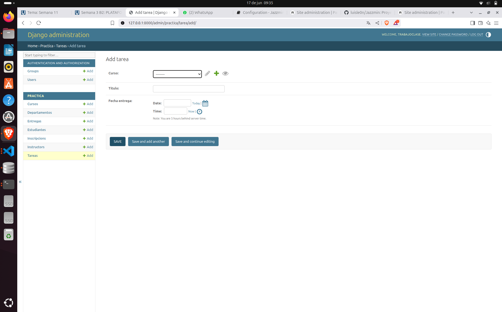
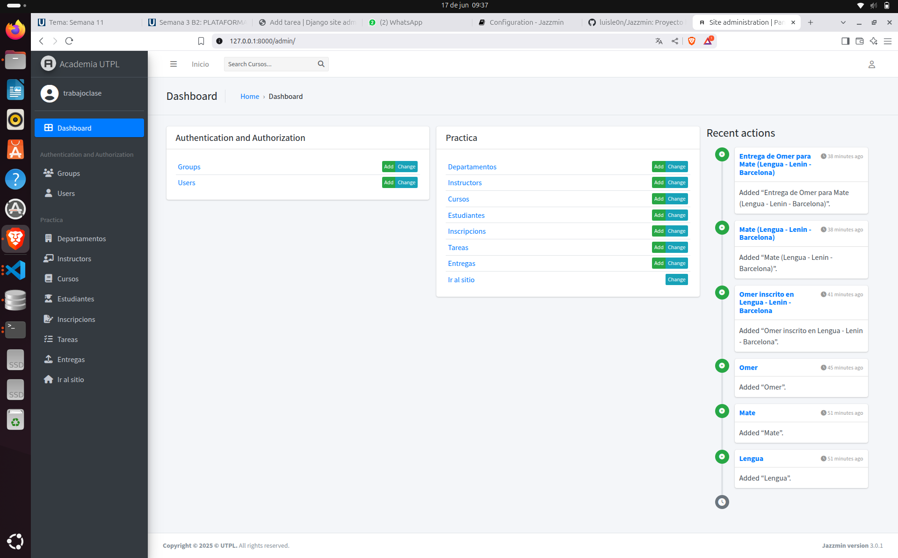

# Jazzmin
Proyecto hecho con django y luego puestas las Configurationes de jazzmin 

## Proyecto antes de usar las configuraciones de jazzmin

## Proyecto depues de usar las configuraciones de jazzmin

